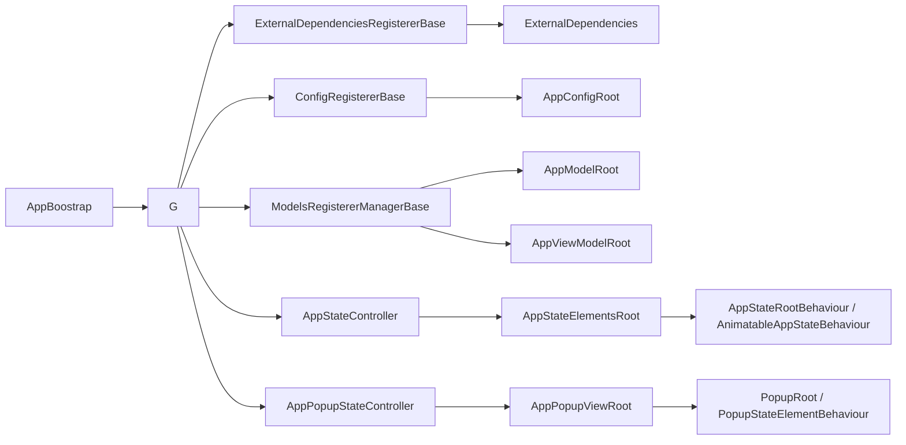

# DingoProjectAppStructure

`DingoProjectAppStructure` is a reusable application-composition layer for Unity projects built on top of `AppStructure`.

This repository is more than a folder skeleton. It provides a working bootstrap pipeline, typed roots for models and dependencies, state-driven screen management, popup infrastructure, input locking helpers, reusable view primitives, and scene-oriented base behaviours for composition.

It is intended for Unity applications where plain `MonoBehaviour` wiring becomes hard to maintain: multiple screens, asynchronous startup, shared services, popups, loading states, runtime models, and explicit ownership boundaries between composition, state, and presentation.

## What It Solves

As Unity projects grow, the same pain points tend to appear:

- bootstrap logic gets scattered across unrelated scene objects;
- service initialization order becomes implicit and fragile;
- UI screens are toggled manually with `SetActive`, which does not scale well;
- popups and modal windows are implemented ad hoc in each scene;
- models, configs, runtime services, and view models have no obvious architectural home;
- onboarding becomes slower because ownership boundaries are blurry.

`DingoProjectAppStructure` addresses that by introducing:

- a predictable application startup lifecycle;
- typed roots for models, view models, configs, and external dependencies;
- explicit controllers for screen states and popup states;
- reusable state-root and view-element abstractions;
- dedicated support for animated screen roots;
- reusable patterns for modal windows and input locking;
- a project structure that matches architectural responsibility.

## Git Dependencies

In the parent project, this package is paired with the following Git submodules visible in `.gitmodules`.

| Dependency | Why it is needed here | Repository | Branch |
| --- | --- | --- | --- |
| `AppStructure` | Base bootstrap, state machine, part-root, and view-root abstractions used throughout `Core/` and `SceneRoot/` | `https://github.com/DingoBite/AppStructure` | `string-as-key-refactor` |
| `DingoUnityExtensions` | Singletons, coroutine helpers, reveal/tween behaviours, pools, navigation, and view-provider building blocks used by the popup and scene layers | `https://github.com/DingoBite/DingoUnityExtensions` | `dev` |

Additional code-level dependencies are also visible in source, but they are not declared as Git submodules in the parent project:

- `Cysharp.Threading.Tasks` (`UniTask`);
- `NaughtyAttributes`;
- `AYellowpaper.SerializedCollections`.

## Repository Structure

| Path | Responsibility | Main contents |
| --- | --- | --- |
| `Core/` | Core runtime abstractions | `AppModelRoot`, `AppViewModelRoot`, `AppStateController`, `AppPopupStateController`, `AppLock`, config and utility types |
| `GenericView/` | Reusable generic UI | modal window elements, modal button pool, popup presentation helpers |
| `SceneRoot/` | Composition and bootstrap layer | `AppBoostrap`, `G`, registerer base classes, scene entry-point wrappers |
| `StateRoots/` | Ready-made state behaviours | logging-oriented state roots and state elements for debugging transitions |

This split is the main architectural contract of the package:

- `Core/` owns reusable runtime concepts;
- `SceneRoot/` owns scene composition and project-specific registration;
- `GenericView/` owns reusable presentation pieces;
- `StateRoots/` owns convenience behaviours for diagnostics and rapid setup.

## Architecture Overview



At runtime the package forms a clear chain:

1. `AppBoostrap` delegates bootstrap stages to `G`.
2. `G` prepares controllers and initializes the application model.
3. Configs and external dependencies are registered.
4. Project models and view models are created and stored in typed roots.
5. Main screen roots and popup roots are initialized, bound, and finalized.
6. The application moves through explicit states such as bootstrap, loading, and start.

## Lifecycle

The package uses the same four-phase lifecycle for every app-structure part:

1. `PreInitialize()`
2. `InitializeAsync()`
3. `BindAsync(appModel)`
4. `PostInitializeAsync()`

This contract is defined by `IAppStructurePart<TAppModel>` and is applied consistently to:

- app view roots;
- state roots;
- state elements;
- static elements;
- popup roots.

### Bootstrap Flow

`SceneRoot/AppBoostrap.cs` inherits from `AppStructure.AppBootstrap` and wires the scene bootstrap to `G`.

The default flow inside `G` is:

1. `PrepareOnAwake()`
   - calls `ExternalDependenciesRegistererBase.AwakePrepare()`;
   - gives config and dependency registerers an early preparation hook.
2. `PrepareController()`
   - initializes `AppInputLocker`;
   - pre-initializes the main state root and popup root.
3. `InitializeControllerAsync()`
   - switches the app to the bootstrap state;
   - creates `ExternalDependencies`;
   - registers configs into `AppConfigRoot`;
   - registers project external dependencies;
   - creates `AppModelRoot`;
   - registers models and view models;
   - runs `AppModelRoot.PostInitializeAsync()` for hard-linked models;
   - invokes `BindToModelAsync()` on the external dependency registerer;
   - initializes the visual roots.
4. `BindAsync()`
   - binds the app model to the main state root and popup root;
   - switches the app to the loading state.
5. `FinalizeAsync()`
   - runs dependency post-initialization;
   - finalizes the visual roots;
   - switches the app to the start state.

### Important Implementation Detail

`ExternalDependenciesRegistererBase.BindToModelAsync()` is declared as an async hook, and the current `G` implementation awaits it before the visual roots are initialized.

In practice this means:

- the hook is a good fit for async binding, initial data loads, and dependency-to-model wiring that must complete before `AppViewRoot.InitializeAsync()` and `AppPopupViewRoot.InitializeAsync()`;
- work that can happen after the view layer is ready may still live in `PostInitializeAsync()` or be scheduled explicitly by the project.

## Core Concepts

### Typed Roots

| Type | Purpose |
| --- | --- |
| `ExternalDependencies` | Type-keyed registry for runtime services and infrastructure objects |
| `AppConfigRoot` | Type-keyed registry for configs |
| `AppModelRoot` | Type-keyed registry for application models |
| `AppViewModelRoot` | Type-keyed registry for application view models |

All of them are built on `RootByGenericTypes<TValue>`, which stores objects by exact CLR type. This gives a lightweight typed alternative to string-based service locator patterns.

### Models

`AppModelRoot` stores project models derived from `AppModelBase`.

If a model needs a second initialization pass after all dependencies have already been registered, it can inherit from `HardLinkAppModelBase` and override:

```csharp
public override Task PostInitialize(ExternalDependencies externalDependencies)
```

That hook is invoked from `AppModelRoot.PostInitializeAsync()`.

### View Models

`AppViewModelBase` receives both:

- `AppModelRoot`;
- `AppViewModelRoot`.

This gives a view model explicit access to domain models and sibling view models without hidden scene lookups.

### Global Facade

`SceneRoot/G.cs` is the main runtime facade exposed by the package.

It provides static access to:

- `G.State`;
- `G.Popup`;
- `G.Lock`;
- `G.M`;
- `G.VM`;
- the lists of main states and popup states.

This is the intended bridge between composition and application code.

## State-Driven UI

The package is designed around state roots instead of manually orchestrated `SetActive` calls.

### Main Building Blocks

| Type | Responsibility |
| --- | --- |
| `AppStateController` | Controls the main screen state machine |
| `AppPopupStateController` | Controls popup states independently from main screens |
| `AppStateMachine` | Main state machine based on `GoBackSupportStateMachine<string>` |
| `AppPopupStateMachine` | Popup open/close state machine based on `OpenCloseStateMachine<string>` |
| `AppStateElementsRoot` | Root that owns screen states and static elements |
| `AppPopupViewRoot` | Root that owns popup states |

`AppStateController` explicitly defines three important state slots:

- bootstrap;
- loading;
- start.

That makes the startup flow readable in scene composition instead of burying it in unrelated components.

### View Element Roles

| Type | Usage |
| --- | --- |
| `AppStateRootBehaviour` | Base state root for a full screen or app state |
| `AnimatableAppStateBehaviour` | Animation-aware variant for screens with reveal/hide transitions |
| `AppStateElementBehaviour` | Element that participates only while a specific state is active |
| `AppStateStaticElementBehaviour` | State-aware static element that reacts to transfers |
| `AppStaticElementBehaviour` | Always-present element that participates in lifecycle but not direct state switching |
| `PopupStateElementBehaviour` | Popup element that also receives transfer parameters |

This separation is one of the strongest practical advantages of the package: every UI piece has a clear lifecycle contract and a clear place in the hierarchy.

### Animation Support

`GenericAnimatableAppStateRoot<TState, TAppModel>` extends `AppStateRoot` with:

- `RevealBehaviour`-driven enable and disable animation;
- automatic `Canvas` enable and disable;
- Unity events for start and finish phases of enable and disable;
- automatic reset to default values after full disable.

Use it when a screen is not only a logical state, but also a visual transition surface.

## Popup and Modal Infrastructure

The popup system is a first-class part of the package.

### Key Types

| Type | Responsibility |
| --- | --- |
| `PopupRoot` | Animatable popup root with escape handling and close-button routing |
| `ModalWindowMessage` | Popup payload with title, message, actions, and ignore policy |
| `PopupModalWindowMessageElement` | Full modal window renderer with dynamic buttons |
| `PopupInfoMessageElement` | Simple informational popup renderer |
| `ModalButton` | Reusable button view driven by `ModalButtonKey` |
| `ModalButtonPool` | Pool for dynamic modal actions |

### Runtime Behaviour

- opening a popup goes through `AppPopupStateController.OpenAsync(string popup, object parameters)`;
- closing goes through `CloseAsync()`;
- `PopupStateElementBehaviour` stores transfer parameters and exposes them to inheritors;
- `PopupRoot` integrates with escape or back navigation and can block closing when `ModalWindowMessage.CanBeIgnored == false`;
- `PopupModalWindowMessageElement` sorts buttons by order and mood, wires navigation edges, and updates default focus.

This yields a reusable modal pipeline for confirmations, warnings, errors, and simple informational windows.

## Input Locking

`Core/AppLock/` contains the package-level solution for temporarily freezing interaction during async work.

### Main Types

- `AppInputLocker`;
- `AppLock`;
- `AppInputLockMessage`;
- `AppInputLockConfigure`.

### What It Provides

- unified entry points for app-wide input lock and unlock;
- optional preloader or view reaction through `AppInputLockMessage`;
- helpers for timed locks and wrapped async tasks;
- less repeated code around loading overlays and temporary interaction blocking.

Typical usage goes through:

- `AppLock.AppSyncLockTime(...)`;
- `AppLock.AppAsyncLockAction(...)`.

If a project wants to model lock flow as a state-driven surface, the package also includes `AppLockStateMachine` and `AppLockViewRoot`.

## Configs and External Dependencies

The package keeps configuration and runtime services separate.

### Config Registration

The config pipeline is built around:

- `ScriptableConfigBase`;
- `ScriptableConfig<T>`;
- `ConfigRegistererBase`.

Configs are registered into `AppConfigRoot`, which keeps `ScriptableObject`-based configuration centralized instead of scattering direct asset references through runtime code.

### External Dependency Registration

`ExternalDependenciesRegistererBase` is responsible for:

- registering infrastructure services;
- preparing systems in `AwakePreInitialize()`;
- binding to models through `BindToModelAsync()`;
- completing additional startup work in `PostInitializeAsync()`;
- disposing subscriptions and resources in `Dispose()`.

The package also contains small utility records for grouped infrastructure:

- `RuntimeDependencies`;
- `RuntimeUpdateConnector`;
- `RuntimeDelegateConnector`;
- `RuntimeSingleCallDelegateConnector`;
- `LogDependencies`.

These records are intentionally simple and type-safe, which makes them easy to expose from project-specific composition code.

## SceneRoot Extension Points

The main project-side extension points are:

- `ConfigRegistererBase`;
- `ExternalDependenciesRegistererBase`;
- `ModelsRegistererManagerBase`;
- `G`.

The intended customization flow is:

1. create a project-specific config registerer;
2. create a project-specific external dependency registerer;
3. create a project-specific model and view-model registerer;
4. expose a project-level facade if needed.

Example:

```csharp
public class ModelsRegistererManager : ModelsRegistererManagerBase
{
    protected override UniTask AddictiveRegisterModelsAsync(AppModelRoot appModelRoot)
    {
        appModelRoot.Register(new SessionModel());
        appModelRoot.Register(new SaveGameModel());
        return UniTask.CompletedTask;
    }

    protected override UniTask AddictiveRegisterViewModelsAsync(
        AppModelRoot appModelRoot,
        AppViewModelRoot appViewModelRoot)
    {
        appViewModelRoot.Register(new MainMenuViewModel(appViewModelRoot, appModelRoot));
        return UniTask.CompletedTask;
    }
}
```

This keeps project-specific logic out of the reusable package while preserving one lifecycle model.

## Standalone Scene Behaviours

`Core/AppRootCore/UnityLifeTime/` contains scene-oriented wrappers:

- `AppStateRootSceneBehaviour`;
- `AnimatableAppStateRootSceneBehaviour`;
- `AppStateElementSceneBehaviour`;
- `AppStaticElementSceneBehaviour`;
- `AppStateStaticElementSceneBehaviour`.

They are useful when you want to:

- prototype a screen in isolation;
- test a state root without the full application scene;
- build tools or debug views;
- run local scene-only composition for a single UI surface.

This is a practical advantage over architectures that only work inside one monolithic root scene.

## Additional Helpers

### Logging Behaviours

`StateRoots/` already includes ready-made logging variants:

- `LogAnimatableAppStateBehaviour`;
- `LogAppStateRootBehaviour`;
- `LogAppStateElementBehaviour`;
- `LogAppStateStaticElementBehaviour`.

They are useful for debugging transitions, subscription timing, and activation order.

### Nested State Controller Wrapper

`AppStateControllerStaticStateElementWrapper` allows an `AppStateController` to participate as a static element inside another lifecycle-driven root.

That is helpful when a feature or sub-flow needs its own local state controller without becoming the application's global root.

### Sub-Controller Base

`SubGameController<TThis>` is a compact singleton helper for feature-local state controllers while preserving the familiar `State` and `States` API.

### Root Access Helpers

`Core/GeneralUtils/AppModelGetExtensions.cs` adds convenience extension methods:

- `appModelRoot.ViewModel()`;
- `appModelRoot.Configs()`;
- `externalDependencies.Configs()`.

It is a small detail, but useful in day-to-day code because it reduces boilerplate around nested root access.

## Recommended Integration Pattern

For a new project, a typical setup looks like this:

1. Add the reusable package under `Assets/AppSDK/DingoProjectAppStructure`.
2. Create a project-specific composition folder such as `Assets/<Project>/AppStructure`.
3. Implement:
   - `ConfigRegisterer`;
   - `ExternalDependenciesRegisterer`;
   - `ModelsRegistererManager`;
   - an optional project facade such as `Game`.
4. Place `AppBoostrap` and `G` into the scene.
5. Wire through the inspector:
   - `AppInputLocker`;
   - `AppStateController`;
   - `AppPopupStateController`;
   - your registerer components.
6. Configure main states in `AppStateController`.
7. Populate `AppStateElementsRoot` with the required screen roots and static elements.
8. Populate `AppPopupViewRoot` with the required popup roots.
9. Register models, configs, and runtime services through the provided typed roots.

## Why This Solution Is Valuable

### 1. Predictable startup instead of scene chaos

Bootstrap order is explicit, readable, and centralized. That reduces hidden dependencies and makes startup failures much easier to diagnose.

### 2. Clear ownership boundaries

The repository structure maps directly to architectural responsibility. New contributors can quickly understand where composition, reusable runtime logic, and generic UI belong.

### 3. Type-safe access patterns

Models, view models, configs, and external services are resolved by type. This is simpler and safer than string keys or ad hoc scene lookups.

### 4. Scalable state-driven UI

Screens, popups, and UI elements live inside one lifecycle model and are controlled by explicit state machines. That scales much better than manually toggling objects.

### 5. Async-friendly by design

The lifecycle is already async-aware, modal workflows are formalized, and app-level input locking is already solved.

### 6. Reusable across projects

Project-specific registration stays in extension classes while the reusable runtime remains generic. That makes the solution portable across multiple Unity applications.

### 7. Easier debugging and onboarding

Logging behaviours, explicit state names, and clear extension points lower the cost of understanding an unfamiliar scene.

### 8. Good fit for complex runtime stacks

Because dependencies, models, and lifecycle are separated cleanly, the solution works well in projects with networking, ECS, persistence, custom input pipelines, or other heavy runtime systems.

## When To Use It

`DingoProjectAppStructure` is especially useful when:

- the project has more than a couple of screens;
- startup depends on multiple services or runtime systems;
- popups and loading states are part of the core UX;
- the team wants explicit composition and ownership rules;
- the project is expected to grow and be maintained by multiple developers.

For a tiny prototype with one scene and almost no runtime composition, the package may be more structure than necessary. For larger projects, the discipline it enforces usually pays off quickly.

