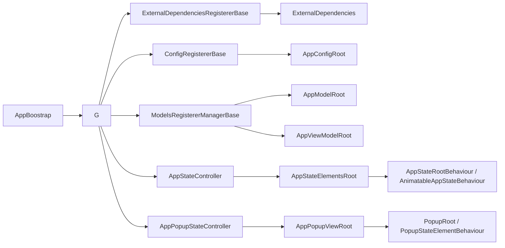

# DingoProjectAppStructure

`DingoProjectAppStructure` это переиспользуемый слой композиции приложения для Unity-проектов, построенных поверх `AppStructure`.

Этот репозиторий не ограничивается шаблоном папок. В нем уже реализованы рабочий bootstrap-пайплайн, типизированные root-объекты для моделей и зависимостей, state-driven управление экранами, popup-инфраструктура, helpers для input lock, reusable view-примитивы и scene-oriented base behaviours для композиции.

Пакет рассчитан на проекты, где обычная связка `MonoBehaviour` начинает расползаться: несколько экранов, асинхронный startup, shared services, popups, loading states, runtime-модели и явная необходимость разделять composition, state и presentation.

## Какие задачи решает

В растущих Unity-проектах обычно повторяются одни и те же проблемы:

- bootstrap-логика размазывается по несвязанным scene object-ам;
- порядок инициализации сервисов становится неявным и хрупким;
- UI-экраны переключаются вручную через `SetActive`, и это плохо масштабируется;
- popups и modal windows реализуются каждый раз заново;
- у моделей, конфигов, runtime-сервисов и view model нет очевидного места в архитектуре;
- новому разработчику сложно быстро понять ownership boundaries.

`DingoProjectAppStructure` решает это через:

- предсказуемый lifecycle старта приложения;
- типизированные roots для моделей, view model, конфигов и внешних зависимостей;
- явные контроллеры для screen state и popup state;
- переиспользуемые state-root и view-element абстракции;
- отдельную поддержку анимируемых экранов;
- готовые паттерны для modal windows и input locking;
- структуру проекта, совпадающую с архитектурной ответственностью.

## Git-зависимости

В родительском проекте этот пакет используется вместе со следующими Git submodule-зависимостями, которые видны в `.gitmodules`.

| Зависимость | Зачем нужна здесь | Репозиторий | Ветка |
| --- | --- | --- | --- |
| `AppStructure` | Базовые bootstrap, state machine, part-root и view-root абстракции, которые используются по всему `Core/` и `SceneRoot/` | `https://github.com/DingoBite/AppStructure` | `string-as-key-refactor` |
| `DingoUnityExtensions` | Singletons, coroutine helpers, reveal/tween behaviours, pools, navigation и view-provider блоки, используемые popup и scene-слоем | `https://github.com/DingoBite/DingoUnityExtensions` | `dev` |

В исходниках также видны дополнительные code-level зависимости, но они не заведены как Git submodule в родительском проекте:

- `Cysharp.Threading.Tasks` (`UniTask`);
- `NaughtyAttributes`;
- `AYellowpaper.SerializedCollections`.

## Структура репозитория

| Путь | Ответственность | Основное содержимое |
| --- | --- | --- |
| `Core/` | Базовые runtime-абстракции | `AppModelRoot`, `AppViewModelRoot`, `AppStateController`, `AppPopupStateController`, `AppLock`, config и utility-типы |
| `GenericView/` | Переиспользуемый generic UI | modal window elements, modal button pool, popup presentation helpers |
| `SceneRoot/` | Composition и bootstrap-слой | `AppBoostrap`, `G`, base registerer-классы, scene entry-point wrappers |
| `StateRoots/` | Готовые state behaviours | logging-oriented state roots и state elements для отладки transitions |

Это и есть главный архитектурный контракт пакета:

- `Core/` владеет переиспользуемыми runtime-концепциями;
- `SceneRoot/` владеет scene composition и project-specific registration;
- `GenericView/` владеет общими presentation-компонентами;
- `StateRoots/` владеет вспомогательными behaviours для диагностики и быстрого старта.

## Обзор архитектуры



Во время исполнения пакет формирует понятную цепочку:

1. `AppBoostrap` делегирует bootstrap-этапы объекту `G`.
2. `G` подготавливает контроллеры и инициализирует модель приложения.
3. Регистрируются конфиги и внешние зависимости.
4. Создаются project models и view model и сохраняются в типизированные roots.
5. Main screen roots и popup roots инициализируются, bind-ятся и финализируются.
6. Приложение проходит через явные состояния вроде bootstrap, loading и start.

## Lifecycle

Пакет использует единый четырехфазный lifecycle для каждой части app structure:

1. `PreInitialize()`
2. `InitializeAsync()`
3. `BindAsync(appModel)`
4. `PostInitializeAsync()`

Этот контракт задается интерфейсом `IAppStructurePart<TAppModel>` и последовательно применяется к:

- app view roots;
- state roots;
- state elements;
- static elements;
- popup roots.

### Bootstrap flow

`SceneRoot/AppBoostrap.cs` наследуется от `AppStructure.AppBootstrap` и связывает scene bootstrap с `G`.

Стандартный flow внутри `G` выглядит так:

1. `PrepareOnAwake()`
   - вызывает `ExternalDependenciesRegistererBase.AwakePrepare()`;
   - дает config и dependency registerer-ам ранний hook для подготовки.
2. `PrepareController()`
   - инициализирует `AppInputLocker`;
   - вызывает pre-initialize у main state root и popup root.
3. `InitializeControllerAsync()`
   - переводит приложение в bootstrap-state;
   - создает `ExternalDependencies`;
   - регистрирует конфиги в `AppConfigRoot`;
   - регистрирует project external dependencies;
   - создает `AppModelRoot`;
   - регистрирует модели и view model;
   - выполняет `AppModelRoot.PostInitializeAsync()` для hard-linked моделей;
   - вызывает `BindToModelAsync()` у external dependency registerer;
   - инициализирует visual roots.
4. `BindAsync()`
   - bind-ит app model к main state root и popup root;
   - переводит приложение в loading-state.
5. `FinalizeAsync()`
   - выполняет dependency post-initialization;
   - завершает post-initialize у visual roots;
   - переводит приложение в start-state.

### Важная техническая деталь

`ExternalDependenciesRegistererBase.BindToModelAsync()` объявлен как async-hook, но в текущей реализации `G` вызывается без `await`.

Практический вывод:

- этот hook хорошо подходит для быстрого bind-а и легких подписок;
- долгую async-работу обычно лучше переносить в `PostInitializeAsync()` или управлять ей явно на стороне проекта.

## Ключевые концепции

### Typed roots

| Тип | Назначение |
| --- | --- |
| `ExternalDependencies` | Типизированный registry для runtime-сервисов и инфраструктурных объектов |
| `AppConfigRoot` | Типизированный registry для конфигов |
| `AppModelRoot` | Типизированный registry для моделей приложения |
| `AppViewModelRoot` | Типизированный registry для view model приложения |

Все они построены на `RootByGenericTypes<TValue>`, который хранит объекты по точному CLR-типу. Это легковесная typed-альтернатива string-based service locator-подходу.

### Модели

`AppModelRoot` хранит project models, наследующиеся от `AppModelBase`.

Если модели нужен второй этап инициализации после того, как все зависимости уже зарегистрированы, она может унаследоваться от `HardLinkAppModelBase` и переопределить:

```csharp
public override Task PostInitialize(ExternalDependencies externalDependencies)
```

Этот hook вызывается из `AppModelRoot.PostInitializeAsync()`.

### View model

`AppViewModelBase` получает сразу:

- `AppModelRoot`;
- `AppViewModelRoot`.

За счет этого view model имеют явный доступ и к domain-моделям, и к sibling view model без скрытых scene lookup-ов.

### Global facade

`SceneRoot/G.cs` это главный runtime-facade пакета.

Он дает статический доступ к:

- `G.State`;
- `G.Popup`;
- `G.Lock`;
- `G.M`;
- `G.VM`;
- спискам main state и popup state.

Это основной мост между composition-слоем и кодом приложения.

## State-driven UI

Пакет строится вокруг state roots, а не вокруг ручного оркестрирования через `SetActive`.

### Главные building blocks

| Тип | Ответственность |
| --- | --- |
| `AppStateController` | Управляет state machine основных экранов |
| `AppPopupStateController` | Управляет popup-state независимо от main screens |
| `AppStateMachine` | Main state machine на базе `GoBackSupportStateMachine<string>` |
| `AppPopupStateMachine` | Popup open/close state machine на базе `OpenCloseStateMachine<string>` |
| `AppStateElementsRoot` | Root, владеющий screen state roots и static elements |
| `AppPopupViewRoot` | Root, владеющий popup states |

`AppStateController` явно задает три важных state slot-а:

- bootstrap;
- loading;
- start.

За счет этого startup flow читается прямо из scene composition, а не расползается по несвязанным компонентам.

### Роли view-элементов

| Тип | Использование |
| --- | --- |
| `AppStateRootBehaviour` | Базовый state root для полного экрана или app-state |
| `AnimatableAppStateBehaviour` | Animation-aware вариант для экранов с reveal/hide transitions |
| `AppStateElementBehaviour` | Элемент, живущий только пока активен конкретный state |
| `AppStateStaticElementBehaviour` | State-aware static element, реагирующий на transfer-ы |
| `AppStaticElementBehaviour` | Всегда присутствующий lifecycle-элемент, не участвующий в state switching напрямую |
| `PopupStateElementBehaviour` | Popup-элемент, который дополнительно получает transfer parameters |

Это одно из главных практических преимуществ решения: у каждого UI-куска есть понятный lifecycle contract и понятное место в иерархии.

### Поддержка анимаций

`GenericAnimatableAppStateRoot<TState, TAppModel>` расширяет `AppStateRoot` следующими возможностями:

- enable/disable-анимации через `RevealBehaviour`;
- автоматическое включение и выключение `Canvas`;
- Unity events на start и finish фаз enable и disable;
- автоматический reset к default values после полного выключения.

Его стоит использовать там, где экран это не только логический state, но и полноценная visual transition surface.

## Popup и modal infrastructure

Popup-система встроена в пакет как first-class механизм.

### Ключевые типы

| Тип | Ответственность |
| --- | --- |
| `PopupRoot` | Animatable popup root с escape-handling и маршрутизацией close-buttons |
| `ModalWindowMessage` | Payload popup-окна с title, message, actions и policy закрытия |
| `PopupModalWindowMessageElement` | Full modal window renderer с динамическими кнопками |
| `PopupInfoMessageElement` | Simple informational popup renderer |
| `ModalButton` | Reusable button view на основе `ModalButtonKey` |
| `ModalButtonPool` | Pool для динамических modal actions |

### Runtime-behaviour

- открытие popup идет через `AppPopupStateController.OpenAsync(string popup, object parameters)`;
- закрытие идет через `CloseAsync()`;
- `PopupStateElementBehaviour` сохраняет transfer parameters и отдает их наследникам;
- `PopupRoot` интегрируется с escape или back navigation и умеет блокировать закрытие, если `ModalWindowMessage.CanBeIgnored == false`;
- `PopupModalWindowMessageElement` сортирует кнопки по order и mood, проставляет navigation edges и обновляет default focus.

В результате получается переиспользуемый modal pipeline для confirm, warning, error и simple info окон.

## Input locking

В `Core/AppLock/` лежит пакетное решение для временной блокировки взаимодействия во время async-операций.

### Основные типы

- `AppInputLocker`;
- `AppLock`;
- `AppInputLockMessage`;
- `AppInputLockConfigure`.

### Что это дает

- единые точки входа для app-wide блокировки и разблокировки ввода;
- возможность показывать preloader или другой view reaction через `AppInputLockMessage`;
- helpers для timed lock и оборачивания async tasks;
- меньше повторяющегося кода вокруг loading overlays и временного отключения взаимодействия.

На практике чаще всего используются:

- `AppLock.AppSyncLockTime(...)`;
- `AppLock.AppAsyncLockAction(...)`.

Если проекту нужен lock-flow как отдельная state-driven поверхность, в пакете также есть `AppLockStateMachine` и `AppLockViewRoot`.

## Конфиги и external dependencies

Пакет явно разделяет конфигурацию и runtime-сервисы.

### Регистрация конфигов

Config pipeline строится вокруг:

- `ScriptableConfigBase`;
- `ScriptableConfig<T>`;
- `ConfigRegistererBase`.

Конфиги регистрируются в `AppConfigRoot`, что позволяет держать `ScriptableObject`-конфигурацию централизованно, а не разбрасывать прямые asset references по runtime-коду.

### Регистрация внешних зависимостей

`ExternalDependenciesRegistererBase` отвечает за:

- регистрацию инфраструктурных сервисов;
- раннюю подготовку систем в `AwakePreInitialize()`;
- привязку к моделям через `BindToModelAsync()`;
- дополнительную startup-работу в `PostInitializeAsync()`;
- очистку подписок и ресурсов в `Dispose()`.

Пакет также содержит небольшие utility records для группировки инфраструктуры:

- `RuntimeDependencies`;
- `RuntimeUpdateConnector`;
- `RuntimeDelegateConnector`;
- `RuntimeSingleCallDelegateConnector`;
- `LogDependencies`.

Они намеренно сделаны простыми и type-safe, чтобы их было легко пробрасывать из project-specific composition-кода.

## Extension points в SceneRoot

Главные точки расширения на стороне проекта это:

- `ConfigRegistererBase`;
- `ExternalDependenciesRegistererBase`;
- `ModelsRegistererManagerBase`;
- `G`.

Ожидаемая схема кастомизации такая:

1. создать project-specific config registerer;
2. создать project-specific external dependency registerer;
3. создать project-specific registerer моделей и view model;
4. при необходимости дать проекту собственный facade.

Пример:

```csharp
public class ModelsRegistererManager : ModelsRegistererManagerBase
{
    protected override UniTask AddictiveRegisterModelsAsync(AppModelRoot appModelRoot)
    {
        appModelRoot.Register(new SessionModel());
        appModelRoot.Register(new SaveGameModel());
        return UniTask.CompletedTask;
    }

    protected override UniTask AddictiveRegisterViewModelsAsync(
        AppModelRoot appModelRoot,
        AppViewModelRoot appViewModelRoot)
    {
        appViewModelRoot.Register(new MainMenuViewModel(appViewModelRoot, appModelRoot));
        return UniTask.CompletedTask;
    }
}
```

Это позволяет держать project-specific логику вне reusable package, сохраняя при этом единый lifecycle.

## Standalone scene behaviours

В `Core/AppRootCore/UnityLifeTime/` лежат scene-oriented wrappers:

- `AppStateRootSceneBehaviour`;
- `AnimatableAppStateRootSceneBehaviour`;
- `AppStateElementSceneBehaviour`;
- `AppStaticElementSceneBehaviour`;
- `AppStateStaticElementSceneBehaviour`.

Они полезны, если нужно:

- прототипировать экран изолированно;
- тестировать state root без полной application scene;
- собирать tools или debug views;
- запускать local scene-only composition для одной UI-поверхности.

Это практическое преимущество по сравнению с архитектурами, которые работают только внутри одного монолитного root scene.

## Дополнительные helpers

### Logging behaviours

В `StateRoots/` уже лежат готовые logging-варианты:

- `LogAnimatableAppStateBehaviour`;
- `LogAppStateRootBehaviour`;
- `LogAppStateElementBehaviour`;
- `LogAppStateStaticElementBehaviour`.

Они удобны для отладки transitions, тайминга подписок и порядка активации.

### Wrapper для вложенного state controller

`AppStateControllerStaticStateElementWrapper` позволяет использовать `AppStateController` как static element внутри другого lifecycle-driven root.

Это полезно, когда отдельной фиче или sub-flow нужен собственный локальный state controller, но он не должен становиться глобальным корнем всего приложения.

### Base для sub-controller

`SubGameController<TThis>` это компактный singleton-helper для feature-local state controllers, который сохраняет привычный API через `State` и `States`.

### Helpers для доступа к roots

`Core/GeneralUtils/AppModelGetExtensions.cs` добавляет удобные extension methods:

- `appModelRoot.ViewModel()`;
- `appModelRoot.Configs()`;
- `externalDependencies.Configs()`.

Это мелкая, но полезная деталь для повседневного кода: меньше boilerplate вокруг доступа к вложенным root-объектам.

## Рекомендуемый паттерн интеграции

Для нового проекта типичная схема выглядит так:

1. Подключить reusable package в `Assets/AppSDK/DingoProjectAppStructure`.
2. Создать project-specific composition-папку, например `Assets/<Project>/AppStructure`.
3. Реализовать:
   - `ConfigRegisterer`;
   - `ExternalDependenciesRegisterer`;
   - `ModelsRegistererManager`;
   - при необходимости facade вроде `Game`.
4. Разместить `AppBoostrap` и `G` в сцене.
5. Связать через инспектор:
   - `AppInputLocker`;
   - `AppStateController`;
   - `AppPopupStateController`;
   - свои registerer-компоненты.
6. Настроить main states в `AppStateController`.
7. Заполнить `AppStateElementsRoot` нужными screen roots и static elements.
8. Заполнить `AppPopupViewRoot` нужными popup roots.
9. Регистрировать модели, конфиги и runtime-сервисы через предоставленные typed roots.

## Почему это решение полезно

### 1. Предсказуемый startup вместо scene chaos

Порядок bootstrap-а здесь явный, читаемый и централизованный. Это снижает число скрытых зависимостей и заметно упрощает диагностику ошибок старта.

### 2. Четкие ownership boundaries

Структура репозитория напрямую отражает архитектурную ответственность. Новому разработчику проще понять, где лежит composition, где reusable runtime-логика, а где generic UI.

### 3. Type-safe доступ к данным и сервисам

Модели, view model, конфиги и external services резолвятся по типу. Это проще и надежнее, чем string keys или хаотичные scene lookups.

### 4. Масштабируемый state-driven UI

Экраны, popups и UI-элементы живут в одном lifecycle и контролируются явными state machine. Такой подход масштабируется гораздо лучше, чем ручное переключение объектов.

### 5. Готовность к async-сценариям

Lifecycle уже async-aware, modal workflows формализованы, а задача app-level input lock уже решена внутри пакета.

### 6. Переиспользуемость между проектами

Project-specific registration остается в extension-классах, а reusable runtime-слой остается общим. Благодаря этому решение удобно переносить между несколькими Unity-проектами.

### 7. Более простой дебаг и онбординг

Logging behaviours, явные имена состояний и понятные extension points уменьшают стоимость входа в незнакомую сцену.

### 8. Хорошая совместимость со сложным runtime-стеком

Так как зависимости, модели и lifecycle разделены явно, решение хорошо работает в проектах с networking, ECS, persistence, custom input pipelines и другими тяжелыми подсистемами.

## Когда использовать

`DingoProjectAppStructure` особенно полезен, если:

- в проекте больше двух-трех экранов;
- startup зависит от нескольких сервисов или runtime-систем;
- popups и loading states являются частью основной UX-логики;
- команде нужны явные правила composition и ownership;
- проект будет расти и поддерживаться несколькими разработчиками.

Для совсем маленького прототипа с одной сценой и почти без runtime composition пакет может оказаться избыточным. Для более крупных проектов дисциплина, которую он задает, обычно окупается очень быстро.
